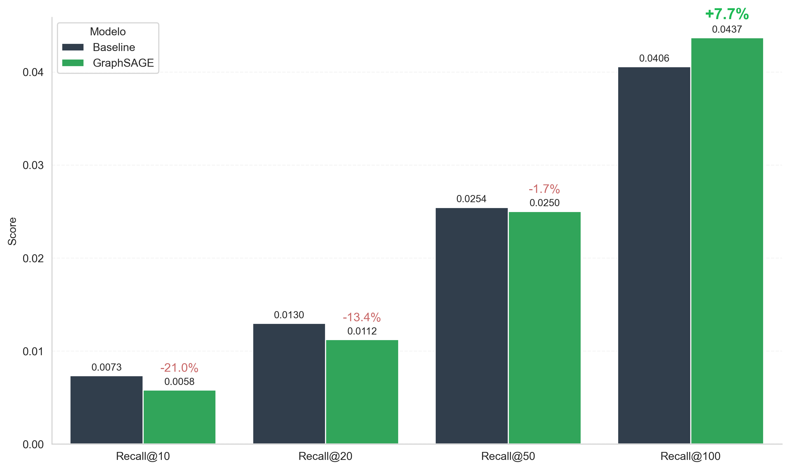
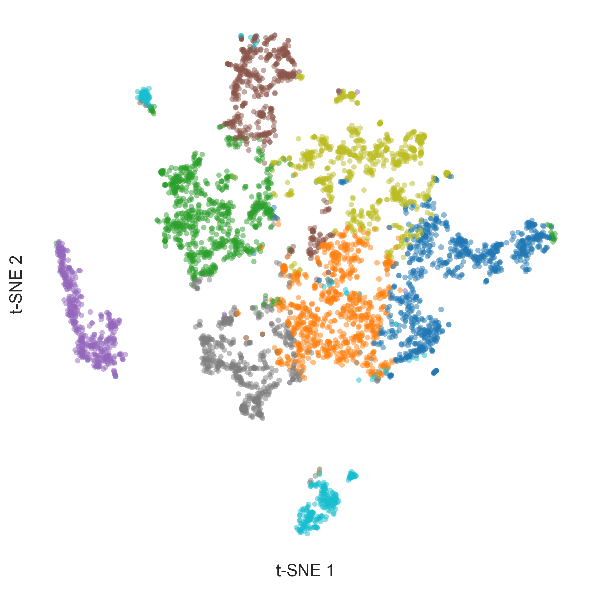

# GraphSAGE Music Recommendation for Cold-Start


> Capstone project (undergraduate thesis) — a music recommender that tackles the
> **cold-start** problem with **Graph Neural Networks (GraphSAGE)** and **graph
> coarsening**.

## Overview

The goal is to recommend **new tracks** (released after a temporal cutoff) that
have **no interaction history**. The approach is hybrid: it combines the
**topological structure** of playlist co-occurrence (via GraphSAGE) with **audio
and content features**, bridging collaborative filtering and content-based
methods.

The pipeline is built on a 100k-playlist subset of the
[Spotify Million Playlist Dataset](https://www.kaggle.com/datasets/himanshuwagh/spotify-million),
enriched with audio features (ReccoBeats API) and artist/album metadata
(Spotify Web API).

### Key contributions

| Component | Description |
|---|---|
| **Graph coarsening** | A hybrid pipeline that compresses **321k tracks → ~20k super-nodes** (15.6× reduction) while preserving local communities |
| **Inductive GraphSAGE** | Learns embeddings for unseen nodes (super-nodes) via neighbourhood aggregation, trained with a BPR ranking loss |
| **Cold-start inference** | Maps brand-new tracks onto super-nodes via weighted KNN over raw audio features |

## Pipeline

The project is organized as a sequence of notebooks (`codes/S0` … `codes/S10`),
run in order. Each notebook reads its paths and hyperparameters from
`conf/config.yaml`.

```
Kaggle MPD + Spotify/ReccoBeats APIs
        │  S1  ingest & enrich  →  S2  clean, feature-engineer, temporal split
        ▼
Bipartite graph (playlists × tracks)
        │  S3  build graph + extract largest connected component (LCC)
        ▼
Graph coarsening (321k → ~20k super-nodes)
        │  S4  MLPb label propagation + content-based matching
        ▼
Super-node item-item graph
        │  S5  cosine projection + KNN sparsification
        ▼
GraphSAGE embeddings
        │  S6  inductive training (BPR loss)
        ▼
Cold-start embeddings for new tracks
        │  S7  weighted KNN over audio features
        ▼
Evaluation & baselines
           S8  cold-start recommender   →  S9  baseline comparison  →  S10  figures
```

## Project structure

```
music-recsys-gnn/
├── codes/                   # Pipeline notebooks (run in order)
│   ├── S0_init_project.ipynb
│   ├── S1_ingest_prep.ipynb
│   ├── S2_transform_load.ipynb
│   ├── S3_load.ipynb
│   ├── S4_coarsening.ipynb
│   ├── S5_projection.ipynb
│   ├── S6_GraphSAGE.ipynb
│   ├── S7_embeddings_new_tracks.ipynb
│   ├── S8_recommender.ipynb
│   ├── S9_baselines.ipynb
│   └── S10_visualization.ipynb
├── conf/
│   └── config.yaml          # Central config (paths, file names, hyperparameters)
├── reports/
│   └── figures/             # Generated figures and charts
├── .env.example             # Environment-variable template
└── requirements.txt         # Dependencies
```

> **Note:** the `data/` and `graphs/` folders are git-ignored because they hold
> heavy artifacts (parquet, npz). See [Data](#data) below.

## Installation

### 1. Clone the repository

```bash
git clone https://github.com/lucasborgs/music-recsys-gnn.git
cd music-recsys-gnn
```

### 2. Create and activate a virtual environment

```bash
python -m venv venv
source venv/bin/activate  # Linux/Mac
# venv\Scripts\activate   # Windows
```

### 3. Install dependencies

```bash
pip install -r requirements.txt
```

> **PyTorch Geometric** needs an extra install step. See the
> [official guide](https://pytorch-geometric.readthedocs.io/en/latest/install/installation.html)
> and pick the build matching your CUDA/CPU setup.

### 4. Configure environment variables

```bash
cp .env.example .env
```

Edit `.env` with your Spotify API credentials (only needed for notebooks S1 and S2):

```
SPOTIFY_CLIENT_ID=your_client_id
SPOTIFY_CLIENT_SECRET=your_client_secret
```

Create your credentials at [developer.spotify.com/dashboard](https://developer.spotify.com/dashboard).

## Data

The raw and processed data are **not** in the repository (too large).
`S0_init_project.ipynb` creates the folder structure, and `S1_ingest_prep.ipynb`
downloads the data from Kaggle and enriches it via the Spotify/ReccoBeats APIs.

Expected layout after running the pipeline:

```
data/
├── raw/
├── interim/
└── processed/

graphs/
├── bipartite/
│   └── coarsened/
├── item_item/
└── super_item_item/
```

## How to run

Run the notebooks from the repository root, in order:

| Step | Notebook | Description |
|------|----------|-------------|
| S0 | `S0_init_project.ipynb` | Create the folder structure |
| S1 | `S1_ingest_prep.ipynb` | Ingest data (Kaggle + Spotify/ReccoBeats APIs) and merge |
| S2 | `S2_transform_load.ipynb` | Cleaning, feature engineering, content embeddings, temporal split |
| S3 | `S3_load.ipynb` | Build the bipartite graph and extract the LCC |
| S4 | `S4_coarsening.ipynb` | Bipartite graph coarsening |
| S5 | `S5_projection.ipynb` | Item-item projection |
| S6 | `S6_GraphSAGE.ipynb` | GraphSAGE training |
| S7 | `S7_embeddings_new_tracks.ipynb` | Cold-start embeddings for new tracks |
| S8 | `S8_recommender.ipynb` | Cold-start recommender + evaluation |
| S9 | `S9_baselines.ipynb` | Baseline comparison |
| S10 | `S10_visualization.ipynb` | Final figures |

All paths are managed through `conf/config.yaml` — no need to edit paths by hand.

## Configuration (`conf/config.yaml`)

Key hyperparameters (read by the notebooks):

```yaml
params:
  coarsening_degree_threshold: 2   # core vs tail split
  coarsening_zeta_target: 70000    # super-node target (clamped to core size)
  projection_knn: 50               # neighbours per super-node (item-item graph)
  gnn_hidden_channels: 64          # embedding dimension
  gnn_lr: 0.001                    # learning rate
  gnn_epochs: 200
  cold_start_knn: 5                # super-node neighbours for new tracks
  recall_k_values: [10, 20, 50, 100]
  seed: 42
```

## Results

### Graph coarsening

The largest connected component (97,594 playlists × **321,160 tracks**) is
compressed to **20,641 super-nodes** — a **15.6× reduction** — while keeping the
playlist–track connectivity intact. The figure below contrasts the original
bipartite graph (a) with its coarsened version (b) for a subset of playlists.


### Cold-start evaluation

The recommender is evaluated on **~53k playlists** that have both a history
(tracks ≤ 2015) and at least one cold-start target (track > 2015, among **60,417**
new tracks). A playlist is represented by the mean of its historical embeddings,
and candidates are ranked by cosine similarity. GraphSAGE is compared against a
**content-only baseline** that uses the same 51 features without the graph.

| Metric | Baseline (content) | GraphSAGE | Δ |
|---|---|---|---|
| Recall@10 | 0.0073 | 0.0058 | −21.0% |
| Recall@20 | 0.0130 | 0.0112 | −13.4% |
| Recall@50 | 0.0254 | 0.0250 | −1.7% |
| **Recall@100** | **0.0406** | **0.0437** | **+7.7%** |
| NDCG@10 | 0.0100 | 0.0070 | −30.0% |
| NDCG@100 | 0.0200 | 0.0184 | −7.9% |



**Reading the results honestly:** the GraphSAGE embeddings improve **broad
retrieval** (Recall@100, +7.7%) — the graph structure helps surface relevant new
tracks deeper in the ranking. The content-only baseline, however, is stronger at
small cutoffs and on NDCG, i.e. at placing relevant items right at the top. In a
strict cold-start regime (no interactions at all for the target tracks), both
models operate at low absolute recall, which is expected for this hard setting;
the contribution here is the **scalable coarsening + inductive embedding pipeline**
rather than a blanket accuracy win.

### Learned structure

t-SNE projection of the GraphSAGE super-node embeddings (coloured by KMeans
cluster) shows the model recovers coherent neighbourhoods:



## Tech stack

- **Python 3.10+**
- **PyTorch + PyTorch Geometric** — GNN (GraphSAGE)
- **NetworkX / SciPy sparse** — graph construction and manipulation
- **scikit-learn** — KNN, TF-IDF/SVD, normalization, metrics
- **Numba** — accelerated label propagation for coarsening
- **pandas / pyarrow** — data pipeline
- **Spotipy + requests** — Spotify / ReccoBeats APIs

## License

Released under the [MIT License](LICENSE).

## Author

**Lucas Borges** — [GitHub](https://github.com/lucasborgs/music-recsys-gnn)
